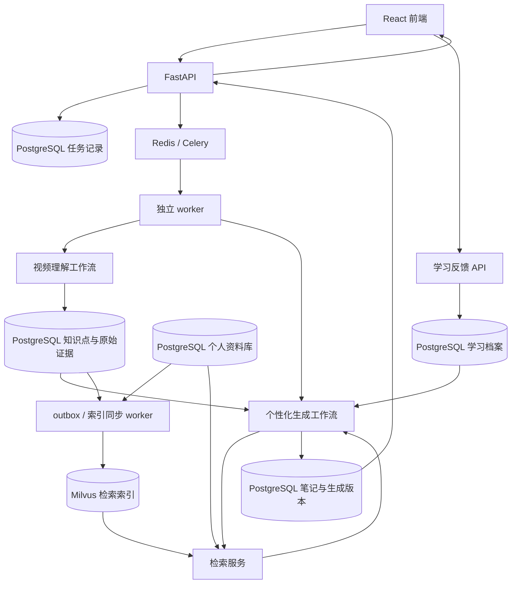

# 个性化视频图文学习助手：开发方案

> 文档日期：2026-09-12  
> 状态：待实施的开发基线，当前工区作尚未实现应用。  
> 已确定的数据库方案：PostgreSQL + Milvus。PostgreSQL 保存业务事实和工作流检查点，Milvus 提供可重建的检索索引。  
> 目标：把视频转换成可追溯的图文学习材料，并根据个人已有知识、掌握证据和学习目标调整讲解重点。

## 1. 产品目标与边界

用户导入视频和个人资料后，系统提取视频中的知识点、例子、画面与时间戳，检索个人相关资料，再生成适合当前学习状态的图文笔记。

预期使用路径：

1. 导入个人 Markdown 笔记，建立可检索的资料库。
2. 上传视频或提供受支持的视频链接，选择本次学习目标。
3. 查看视频处理进度与可重试的错误信息。
4. 阅读重点展开、已有知识折叠的图文笔记，点击来源回看视频。
5. 对知识点反馈“已掌握”“仍不懂”，或完成可选测验。
6. 下一次生成时使用更新后的学习档案，也可重新生成当前笔记。

### 1.1 必须保持的设计原则

- **资料库与学习档案分开。** 收藏、导入、生成或阅读过资料，不自动代表掌握。
- **未知掌握状态不等于不会。** 缺少证据时保留正常讲解，不做强判断。
- **相关不等于重复。** 同一主题的新条件、反例、步骤和版本变化必须保留。
- **弱化采用折叠。** 被压缩的知识仍可展开并回看原始来源。
- **先保留证据，再生成讲解。** 核心结论关联字幕片段或画面，辅助推导单独标注。
- **工作流显式可控。** 下载、截图、存储由程序执行；理解、比较和讲解由模型辅助。
- **每个阶段可观察、可重试。** 不把整个视频处理塞进一次模型调用。
- **模型与提示词可替换、可追踪。** 不在业务代码里绑定某个提供商的响应格式。

### 1.2 第一版范围

| 包含 | 暂缓 |
| --- | --- |
| 单用户、本地 Web 应用 | 多租户 SaaS、计费和组织管理 |
| 本地视频上传；首个平台优先 Bilibili | 一次支持所有视频平台 |
| Markdown 资料导入 | Notion、语雀等双向同步 |
| 字幕优先、语音识别兜底 | 端到端实时直播处理 |
| 关键帧、基础 OCR、按需视觉理解 | 动作识别与完整代码执行环境 |
| 来源时间戳、折叠阅读、Markdown 导出 | 原生移动端、桌面安装包 |
| 知识差异比较、明确的用户反馈 | 复杂知识追踪模型、自动心理画像 |
| 简单知识依赖关系 | 全量图数据库、自动课程推荐系统 |

本地文件路径是首个可验收输入，平台链接通过独立适配器后接入，平台访问失败不阻断本地文件能力。

## 2. 技术选型与决策

| 层级 | 默认选择 | 用途与说明 |
| --- | --- | --- |
| 前端 | React + TypeScript + Vite | 单页应用，视频和图文双栏阅读 |
| 界面 | Tailwind CSS + shadcn/ui | 上传、进度、折叠卡片和反馈控件 |
| 内容渲染 | react-markdown + KaTeX + Mermaid | Markdown、公式、结构图；禁用任意 HTML 执行 |
| 后端 | Python 3.11 + FastAPI | HTTP API、文件管理、反馈接口；依赖安装时核对兼容性 |
| 数据结构校验 | Pydantic | 模型输出、API 输入和配置校验 |
| Agent 编排 | LangGraph | 显式节点、条件路由、检查点与恢复 |
| 后台执行 | Celery + Redis | 调度独立 worker，控制任务并发 |
| 业务数据库 | PostgreSQL | 资料正文、知识点、学习记录、任务、笔记及 LangGraph 检查点 |
| 检索数据库 | Milvus Standalone | 文本向量检索、BM25 关键词检索与结果融合；图片向量后续加入 |
| 检索客户端 | PyMilvus | Milvus collection、索引、写入、过滤及混合查询 |
| ORM 与迁移 | SQLAlchemy + Alembic | PostgreSQL 数据访问和表结构迁移；Milvus schema 单独版本化 |
| 媒体工具 | FFmpeg + OpenCV | 抽音轨、截图、清晰度筛选和去重 |
| 平台获取 | 平台适配器 + yt-dlp 候选实现 | 只承诺经过实际验证的输入类型 |
| 转写 | faster-whisper 或托管 ASR API | 无合适字幕时启用 |
| OCR | PaddleOCR | 按需识别关键帧上的文字 |
| 视觉模型 | Qwen3-VL 等多模态模型候选 | 图表、代码与操作画面的辅助理解 |
| 向量模型 | BGE-M3 | 中英文检索初始基线，记录模型及版本 |
| 重排序 | bge-reranker-v2-m3，可选 | 当检索评估显示需要时启用 |
| 文件 | 本地数据目录 + 存储接口 | 后续切换对象存储，不改变业务模型 |
| 包管理 | uv、pnpm | 提交锁文件，保证环境可复现 |
| 部署 | Docker Compose | API、worker、PostgreSQL、Redis、Milvus Standalone 及所选版本要求的依赖服务 |
| 测试 | pytest、Vitest、Playwright | 服务逻辑、前端交互和端到端验证 |

以上为起始选型，并非已验证的依赖组合。实施时锁定兼容版本，不使用漂移的 `latest` 作为发布基线，也不因文档中的候选模型先行购买 GPU。

### 2.1 为什么采用 LangGraph

本项目有字幕/转写分支、按章节提取、证据不足时补充检索、图文校验和局部重试，需要明确的状态与执行路径。

LangGraph 负责一次工作流内部的节点推进；Celery 负责把任务交给 worker；PostgreSQL 保存长期业务事实。三个层次分别承担职责。

| 框架 | 何时考虑 |
| --- | --- |
| LangGraph | 默认选型，适合显式状态和可恢复的多步生成 |
| LlamaIndex Workflows | 团队更熟悉其资料接入、检索生态时，可替代主编排层 |
| CrewAI Flows | 已采用 CrewAI，且确有角色协作需求时考虑 |
| Temporal | 大量跨服务长任务需要更完整的持久化执行运维时评估 |

第一版只使用一个主编排框架。暂不叠加 LangGraph、CrewAI、LlamaIndex 三套编排；也不同时引入 Celery 和 Temporal 管理同一层任务生命周期。

### 2.2 模型调用策略

- 文本模型先选一个支持中文和结构化输出的托管模型，用真实课程比较质量与成本后固定模型 ID。
- 视觉模型只接收有意义的关键帧及附近字幕，避免逐帧全量调用。
- ASR 优先用已有字幕，检查覆盖和异常；质量不足时再转写。处理专业名词时保留原始转写与纠正版本。
- Embedding 与 reranker 使用独立接口，不能把重排序分数当掌握概率。
- 本地推理是部署选项，不是第一版前提。模型客户端需暴露超时、速率限制、Token 用量和错误分类。
- 统一业务接口，例如 `extract_knowledge`、`compare_claims`、`generate_lesson`，在适配层处理供应商差异。

### 2.3 PostgreSQL 与 Milvus 的职责

- **PostgreSQL 是权威数据来源。** 保存资料与片段正文、来源证据、知识点关系、学习档案、笔记版本、任务、索引同步记录以及 LangGraph 检查点。
- **Milvus 是检索索引。** 保存向量、用于 BM25 的文本副本及过滤元数据，通过稳定的 `chunk_id` 关联 PostgreSQL；索引可以从权威资料和模型配置重建。
- 本方案不安装 pgvector，也不在 PostgreSQL 中建设第二套向量检索。关键词召回与向量召回统一在 Milvus 完成。
- PostgreSQL 事务不能覆盖 Milvus 写入。采用 outbox + 幂等索引任务，明确导入、更新、删除和重建的可见性边界，详见 6.3。
- Milvus 保存的文本与元数据是派生副本；返回候选后必须回查 PostgreSQL 中的正文、归属、版本与删除状态，再交给模型使用。
- 掌握状态更新只写 PostgreSQL，不为每次用户反馈重建向量索引。
- 检索接口封装为 `index_chunks`、`search_chunks`、`delete_chunks` 和 `get_index_status`，业务节点不直接拼接 Milvus 查询表达式。

## 3. 总体架构



### 3.1 两个独立工作流

**视频理解工作流**：对内容版本执行一次，产生字幕、截图、知识点和证据。个人学习状态变化不触发重新下载或转写。

**个性化生成工作流**：读取已提取的视频知识、个人资料及学习档案快照，产生一版笔记。目标或掌握程度变化后创建新生成任务，保留旧笔记。

**索引同步任务**由上述内容写入及 Markdown 导入产生的 outbox 事件触发，不是第三个自主 Agent。它将分块和向量同步到 Milvus。视频理解完成与知识库“可检索”是两个状态；个性化生成固定使用已发布且索引就绪的知识库修订。

用户反馈单独处理，不让视频理解任务等待用户阅读。确实需要外部输入才能继续的步骤，才使用 LangGraph interrupt；普通阅读反馈无需暂停整个图。

### 3.2 MVP 进程与资源配置

- API 只负责接收请求和返回状态，不在 HTTP 请求生命周期内转写视频。
- 开发环境先用一个 worker，任务并发设为 1，跑通正确性。
- 媒体处理使用受控子进程，设置超时、取消检查与退出清理。
- 增加并发时，再区分媒体/ASR 队列和模型生成队列，限制 GPU 同时使用数量。
- 不在占满 worker 的父任务内同步等待同队列子任务，避免死锁。跨队列拆分应由完成事件推进后续阶段。
- Windows 上 worker 和 Milvus Standalone 运行于 WSL2/Linux 容器；PostgreSQL 和 Redis 也建议容器化。

### 3.3 Milvus 部署基线

- 默认使用 Milvus Standalone，按所选稳定版本的官方 Compose 配置部署并保留其必要依赖；第一版不引入分布式集群。
- 锁定 Milvus 服务端与 PyMilvus 的兼容版本，验证 BM25、中文 analyzer、混合检索及一致性配置后再固化部署文件。
- PostgreSQL、Milvus 及其依赖服务使用独立持久化卷，配置健康检查和重启策略；Milvus 内部存储与应用的视频/截图存储分开管理。
- `.env.example` 规划包含 `DATABASE_URL`、`MILVUS_URI`、`MILVUS_TOKEN`、`MILVUS_DB_NAME`、`MILVUS_COLLECTION_PREFIX` 和 `EMBEDDING_MODEL_ID`，凭据不提交仓库。
- Milvus Lite 仅可用于可选的本地实验，其平台和功能限制不作为主方案的验收环境。
- 备份以 PostgreSQL、原始资产及模型/分块配置为重建依据，同时明确 Milvus 备份或重建时间目标；索引可重建不代表无需考虑恢复成本。

## 4. 视频理解工作流

```text
validate_source
  → acquire_media_or_captions
  → normalize_transcript（字幕可用；否则 ASR）
  → select_candidate_frames
  → analyze_visuals（按需 OCR / 多模态理解）
  → align_and_segment
  → extract_knowledge
  → validate_evidence
  → persist_content_version
```

保存内容版本时，在同一 PostgreSQL 事务中写入待索引事件。提交后由索引任务推进 Milvus 写入；该任务失败只重试索引阶段，不重新转写视频。

上述流程是 MVP 的顺序执行基线。测出瓶颈后，可让音频和截图处理并行，再显式汇合；不要为了并行提前增加图状态冲突。

### 4.1 获取与转写

1. 校验输入，建立 source 记录，计算本地文件哈希或平台内容标识。
2. 获取字幕并归一化为 `segment_id/start_ms/end_ms/text`。
3. 检查空字幕、时间范围异常、明显缺段与语言问题；不要只看“有没有文件”。
4. 字幕不合适时提取音频，执行 ASR，保留语言、模型及生成版本。
5. 下载失败时提供平台、失败阶段和可操作说明，不自动反复下载。

### 4.2 截图与画面理解

- 初筛结合画面变化和周期性候选帧，随后按清晰度、重复程度和内容相关性筛选。
- PPT 视频保留有信息的页面与图表；操作视频优先保留操作前后状态。
- 截图质量差时可在附近时间范围内补取，补取次数设置上限。
- OCR、视觉描述与字幕均保留来源时间范围，不把视觉模型的推测写成原视频事实。
- 画面质量不足时输出明确的局限说明；允许生成文字笔记，不虚构操作位置或图表数据。
- 短暂出现的关键画面可能被采样遗漏，第一版提供用户手动补充截图入口或记录待实现事项。

### 4.3 知识点提取

按主题分段后提取细粒度论断，不只保存章节摘要。例如将“联合索引”进一步拆成适用条件、查询示例、注意事项和反例。

每条提取结果至少包含：

```json
{
  "concept_name": "联合索引",
  "claim": "视频中的一条具体结论，保留适用条件",
  "conditions": ["版本或场景限制"],
  "examples": ["来源中的具体例子"],
  "prerequisites": ["必要的前置概念"],
  "evidence_ids": ["segment_012", "frame_008"],
  "extraction_status": "supported"
}
```

示例仅说明结构，不代表真实提取结果。候选概念的别名合并和依赖关系需保留判断依据，避免把相似名称的不同概念错误合并。

## 5. 个性化生成工作流

```text
load_content_and_profile_snapshot
  → retrieve_personal_context
  → compare_claims
  → decide_coverage
  → plan_lesson
  → generate_blocks
  → validate_notes
  → persist_note_version
```

### 5.1 检索与比较

1. 以视频知识点、关键术语和具体论断检索旧资料。
2. 在 Milvus 中分别执行 BGE-M3 dense 向量召回与 BM25 关键词召回，以 RRF 作为初始融合方案，需要时加入 reranker。
3. BM25 使用显式配置的中文 analyzer，验证代码标识符、混合语言和专业术语的切分结果。BM25 的稀疏字段与 BGE-M3 输出的 sparse 向量不是同一套数据；第一版使用内置 BM25，不混写两者。
4. 所有检索由服务端加入用户/知识库归属、索引版本及本次知识库快照允许的内容版本过滤；返回候选后按 `chunk_id` 回查 PostgreSQL，校验权限、版本和删除状态，读取正文、证据及掌握记录。
5. 过滤后候选不足时有限扩大召回或返回不足原因；Milvus 不可用或索引未就绪不能解释为“用户没有相关知识”。
6. 模型比较具体结论、条件、方法和例子，输出证据 ID 与理由。
7. 检索排除本次正在分析的内容版本和当前待生成笔记，避免将本次输入或输出当作用户的历史知识。历史生成笔记可按知识库快照参与检索，但不自动成为掌握证据。

召回数量、片段大小、相似度阈值属于待评估参数，不预设一个“通用正确”的固定值。先用人工标注的小集合调参。

### 5.2 两个维度分别建模

**内容差异**：`duplicate / extension / novel / conflict / uncertain`。

**个人掌握状态**：`unassessed / exposed / understood / applied / needs_review`。

前者描述新内容与已有资料的关系，后者描述人的状态。不能因检索到重复资料就直接标记掌握。

| 条件 | 默认呈现 |
| --- | --- |
| 重复 + 足够可靠的掌握证据 | 一句话回顾，详细内容折叠 |
| 重复 + 掌握状态未评估 | 正常说明，可让用户快速标记 |
| 熟悉概念的新条件、例子或反例 | 保留必要连接，重点解释新增部分 |
| 新知识 | 按学习目标展开，检查必要前置知识 |
| 证据冲突 | 并列来源、版本和适用条件，不擅自覆盖旧结论 |
| 判断不确定 | 保留讲解，标记不确定原因 |

即使属于已掌握知识，只要它是理解新内容所必需的前置条件，也保留简短连接。学习目标影响优先级，不能成为遗漏关键条件的理由。

### 5.3 学习状态更新

- 用户显式反馈记录为事件，自评与测验结果分开保存。
- “已掌握”属于自评证据；一次简单选择题正确不直接代表能够应用。
- “仍不懂”应立即影响下一次呈现，但不能删除已有历史证据。
- 阅读、停留时长和自动生成只记录行为，不提升掌握状态。
- 时间久远可降低证据可信度或提示复习；第一版不声称精确估计遗忘概率。
- 状态由可解释规则从证据汇总，保存规则版本。积累数据后再评估知识追踪算法。
- 支持撤销误操作，并从剩余事件重新汇总状态。

### 5.4 图文输出协议

先生成结构化块，再由程序渲染为 Markdown/网页，避免完全依赖模型自由排版。

```json
{
  "type": "knowledge_card",
  "concept_id": "concept_001",
  "title": "本节要学习的知识点",
  "display_mode": "expanded",
  "decision_reason": "包含旧资料没有覆盖的适用条件",
  "body_markdown": "解释、例子与必要的前置说明",
  "source_evidence_ids": ["segment_012"],
  "image_asset_ids": ["frame_008"],
  "supplemental": false
}
```

- 正文以原视频截图为主要图片来源；流程图可用 Mermaid 生成。
- 系统补充解释与原视频内容区分展示，必要时为补充内容另附来源。
- 引用 ID 必须映射到真实证据，模型不能自行构造时间戳和资源 URL。
- Markdown 导出采用 `.md + assets/` 文件夹或 ZIP，使用可移植相对路径。
- 网页图片走受控资源接口，避免把本机路径作为页面资源地址暴露。

## 6. 数据模型

以下是 PostgreSQL 逻辑表设计；实施时可以按访问模式合并或拆分，但保留相同的数据边界。向量字段与 BM25 索引位于 Milvus，见 6.2。

| 表 | 主要字段 | 关键约束 |
| --- | --- | --- |
| `sources` | id, owner_id, type, source_uri, content_hash | 区分本地视频、平台视频和文档 |
| `content_versions` | id, source_id, pipeline_version, config_hash, status | 内容理解结果不可变，重处理建新版本 |
| `assets` | id, version_id, kind, storage_key, checksum, timestamp_ms | 文件在存储层，数据库只保存引用 |
| `evidence_segments` | id, version_id, start_ms, end_ms, text, frame_id | 保存原始证据与定位信息 |
| `knowledge_chunks` | id, owner_id, version_id, text, evidence_ids, content_hash, deleted_at | 保存片段正文与来源，不保存用于查询的向量列；版本内片段不可变 |
| `index_generations` | id, collection_name, schema_version, embedding_model, dimension, metric, analyzer_config, status | 记录 Milvus collection 与完整索引配置，重建创建新代次 |
| `chunk_index_states` | chunk_id, index_generation_id, vector_id, operation, status, attempts, last_error, indexed_at | 组合唯一键；跟踪 upsert/delete 的实际结果，而非仅跟踪消息投递 |
| `knowledge_base_revisions` | id, owner_id, index_generation_id, status, published_at | 只有所需索引已就绪的修订可发布给新生成任务 |
| `revision_content_versions` | revision_id, content_version_id | 明确每个知识库快照允许检索的内容版本集合 |
| `concepts` | id, owner_id, canonical_name, aliases | 概念身份稳定，不只用字符串名称关联 |
| `claims` | id, concept_id, version_id, statement, conditions, evidence_ids | 同概念允许多条不同论断 |
| `concept_edges` | from_id, to_id, relation, evidence, confidence | 前置、补充等关系，允许修正 |
| `learning_events` | id, user_id, concept_id, event_type, payload, occurred_at | 自评、测验、撤销事件可追溯 |
| `mastery_states` | user_id, concept_id, status, confidence, evidence_ids, revision | 可从事件重新计算 |
| `note_versions` | id, user_id, content_version_id, profile_revision, blocks, status | 保存知识库快照/修订标识和生成配置 |
| `jobs` | id, kind, parent_job_id, status, graph_thread_id, attempt, lease_until | 同一任务只允许一个执行者推进 |
| `job_events` | id, job_id, stage, message, created_at | 持久化进度，支持断线后查询 |
| `outbox_events` | id, aggregate_id, type, payload, dispatched_at | 保证数据库提交后任务通知可补发 |

LangGraph 检查点使用其 PostgreSQL checkpointer 的独立表，不将检查点表当业务 API 的查询模型。

### 6.1 版本与缓存边界

- 视频理解缓存键：内容标识/哈希 + 处理流水线版本 + 有效模型/参数配置。
- 个性化结果缓存键：用户 + 内容版本 + 知识库修订 + 学习档案修订 + 学习目标 + 提示词/模型配置。
- 同一用户重新提交完全相同请求可返回已有任务；学习目标变化则新建生成任务。
- 模型替换、Embedding 维度、距离度量、分块策略或 analyzer 配置变化时，新建 `index_generation` 与 collection 并重建，不能混用不兼容向量。知识库修订固定引用具体索引代次。
- 生成期间使用学习档案快照。反馈到达后标记“可按最新状态重新生成”，不在同一篇笔记中混用不同档案版本。

### 6.2 Milvus collection 设计

初期按索引代次建立文本 collection，例如 `knowledge_text_v1`，通过元数据过滤用户和来源，不按视频创建 collection。

| 字段 | 类型/用途 | 说明 |
| --- | --- | --- |
| `vector_id` | VARCHAR 主键 | 由 chunk_id 与 index_generation_id 确定性生成；禁用自动 ID 以支持幂等 upsert |
| `chunk_id` | VARCHAR | 对应 PostgreSQL `knowledge_chunks.id` |
| `owner_id` | VARCHAR | 服务端注入的归属过滤，不依赖客户端自报 |
| `source_id` | VARCHAR | 来源标识 |
| `content_version_id` | VARCHAR | 对应不可变内容版本，用于快照检索 |
| `index_generation_id` | VARCHAR | 对应索引配置代次 |
| `text` | VARCHAR 文本副本 | 开启 analyzer，用于 BM25；按分块策略设置并校验 UTF-8 字节长度上限 |
| `text_dense` | FLOAT_VECTOR | BGE-M3 初始配置为 1024 维，模型切换需重新验证 |
| `text_bm25` | SPARSE_FLOAT_VECTOR | Milvus 内置 BM25 Function 从 text 生成 |

起始索引方案为 dense 使用 HNSW/COSINE，BM25 使用稀疏倒排索引/BM25；具体索引参数和能力以锁定版本的验收为准，不预设性能结论。RRF 融合两个召回列表的排名，reranker 如启用则作用于融合后的候选正文。

图片向量暂不加入文本 collection。后续使用独立的图片 collection 与适配的跨模态 Embedding 模型，通过 asset_id、来源和时间戳关联；BGE-M3 文本向量不能直接用于查询不兼容的图片向量。

### 6.3 索引同步、可见性与删除

**导入与更新：**

1. PostgreSQL 事务写入不可变内容版本、chunks、待处理的 `chunk_index_states` 和 outbox 事件。
2. 索引 worker 读取权威正文和固定配置，生成 dense 向量，幂等 upsert 到目标 collection；BM25 由服务端按已定义的 Function 处理。
3. 每批成功后记录进度。只有目标写入满足查询可见性、数量和版本校验，才标记索引就绪；不能将 `outbox.dispatched_at` 当作索引完成。
4. 所需片段就绪后发布新的知识库修订。更新失败时保留上一版可用快照，界面显示新资料仍在索引中。
5. worker 崩溃或批量写入部分成功时，根据片段状态补写；稳定主键使重复消息不产生重复检索记录。

**查询一致性：**

- 第一版显式使用 Milvus `Strong` 一致性进行导入验收与个性化检索，避免跨 worker/API 客户端误用仅保障同会话的可见性。
- 该设置只作用于 Milvus 已接收的数据，不保证 PostgreSQL 与 Milvus 跨库原子提交；跨库就绪仍由索引状态和知识库发布流程控制。
- 生成任务绑定具体知识库修订、内容版本集合与 collection。新修订不改变运行中任务的检索范围，旧快照的依赖在相关任务完成前保留。
- Milvus 不可用时，已有笔记仍可阅读，新个性化任务显示可重试错误；只有用户明确选择通用笔记时才绕过个性化，不能静默推断没有旧知识。
- 空知识库与故障不同：经 PostgreSQL 确认快照确实为空时，可正常生成并说明暂无掌握证据。

**删除与重建：**

- 删除先在 PostgreSQL 记录 tombstone 并创建索引删除事件；回查阶段立即拒绝已删除或已撤权的候选，即使 Milvus 尚有旧记录。
- upsert/delete 对同一片段使用串行化或租约控制，并检查最新删除状态；删除优先于旧快照，过期写入需补偿清理。
- 定期对账缺失、过期和多余的索引记录，处理重试后仍未完成的同步。物理删除 Milvus 派生数据后确认状态，必要时使依赖已删除资料的生成任务失效。
- 重建在新 collection 中进行，验证完成后发布指向新代次的修订；运行中任务继续使用仍有效的旧 collection。回滚窗口和依赖任务结束后再清理旧索引。
- 保留原始正文、分块规则、模型 ID 与修订、维度、距离度量、analyzer 和 schema 配置。若使用固定版本的 Embedding 缓存降低重建费用，它属于可校验的派生产物，不是新的权威数据库。

## 7. LangGraph 状态与执行可靠性

### 7.1 状态只保存必要引用

建议图状态包含：

```text
job_id, user_id, source_id, content_version_id
profile_revision, knowledge_base_revision, index_generation_id, collection_name, learning_goal
transcript_asset_id, frame_asset_ids, claim_ids
comparison_result_id, lesson_plan_id, draft_id
validation_issues, repair_attempts, budget_usage
```

大量字幕、二进制图片、视频、模型客户端和数据库连接不放进检查点。大型结构化结果保存到业务存储，再把 ID 放入状态。

不同工作流与不同任务使用独立 `graph_thread_id`，例如 `ingest:{job_id}` 与 `personalize:{job_id}`。恢复原任务使用原 ID；重新生成使用新任务、新 ID。身份授权仍由服务端校验，不能仅凭 thread ID 访问状态。

### 7.2 调度、检查点与幂等

1. API 在事务中写入 job 与 outbox 事件。
2. 调度器将 outbox 投递到队列；失败可再次投递。
3. worker 获取数据库租约后推进工作流，定期更新心跳。
4. 每个已完成阶段保存业务结果和检查点。
5. worker 崩溃后，恢复器检查过期租约并重新投递，加载已有检查点继续。
6. 终态任务被重复投递时直接返回已有结果。

队列投递按“可能重复”设计；检查点也不会让外部副作用天然恰好发生一次。写笔记、保存文件等节点以 `job_id + stage + input_version` 设置幂等键与唯一约束，文件写入采用临时文件完成后原子替换等方式。

### 7.3 重试策略

| 故障 | 处理 |
| --- | --- |
| 模型限流、短暂超时 | 节点有限重试，指数退避并尊重服务端等待提示 |
| 平台链接不支持、凭据失效 | 停止当前阶段，返回可操作错误 |
| Pydantic 校验失败 | 进行有限次数结构修复，仍失败则保留诊断信息 |
| 图片缺失、证据 ID 无效 | 重新选图或删除无依据部分，不能直接发布为完成 |
| worker 崩溃 | 调度层恢复，复用业务结果与检查点 |
| Milvus 暂时不可用或批量索引部分失败 | 仅重试查询或未就绪的索引批次；不重复转写，不发布未就绪修订 |
| 检索候选已删除或版本不符 | PostgreSQL 回查剔除，有限补充召回，并安排索引对账 |
| 用户取消 | 设置取消标记，在阶段边界和媒体子进程处响应 |

网络节点可以重试，语义校验修复环也可以循环，但两者有独立且有限的预算。避免整条工作流重试与节点重试相乘导致重复费用。

MVP 可将语义修复上限设为 2 次，属于待验证的工程初值。超限进入失败或“完成但有明确局限”的结果，不能无限自我反思。

取消与完成竞争时用条件更新保证只有一个终态胜出；旧 worker 的过期租约不能覆盖新执行者的结果。

## 8. API 与前端页面

### 8.1 建议接口

| 方法与路径 | 作用 |
| --- | --- |
| `POST /api/sources/uploads` | 上传本地文件，返回 source_id；大文件流式写入 |
| `POST /api/sources/links` | 登记平台链接并校验适配器支持情况 |
| `POST /api/knowledge/imports` | 导入 Markdown 文件或目录包 |
| `GET /api/knowledge/imports/{id}` | 分别返回解析与索引状态、失败原因及已发布的知识库修订 |
| `POST /api/knowledge/imports/{id}/retry-index` | 幂等补跑索引阶段，不重新解析已完成的正文 |
| `POST /api/jobs/ingest` | 创建视频理解任务，返回 202 与 job_id |
| `POST /api/jobs/personalize` | 对指定内容版本创建个性化生成任务 |
| `GET /api/jobs/{id}` | 获取状态、阶段、错误及结果 ID |
| `GET /api/jobs/{id}/events` | SSE 进度流，使用事件游标恢复 |
| `POST /api/jobs/{id}/cancel` | 请求取消任务 |
| `POST /api/jobs/{id}/retry` | 重试允许恢复的失败任务 |
| `GET /api/notes/{id}` | 获取笔记块、引用和版本信息 |
| `POST /api/notes/{id}/regenerate` | 根据最新档案创建新生成任务 |
| `POST /api/learning-events` | 提交自评或测验结果 |
| `POST /api/learning-events/{id}/revoke` | 撤销错误反馈，保留事件历史 |
| `GET /api/notes/{id}/export` | 导出 Markdown 与图片 ZIP |

创建任务接口支持请求幂等键。前端关闭或 SSE 断开不应取消后台任务，重连后可通过 GET 状态补齐。第一阶段可先轮询，SSE 不阻断核心功能交付。

个性化任务返回其绑定的知识库修订；若用户指定尚未就绪的修订，接口应返回明确的索引未就绪状态，而不是无限占用 worker 等待同队列的索引任务。

任务状态建议：`queued / running / waiting_input / succeeded / succeeded_with_warnings / failed / cancelled`。只有确实需要外部输入的流程使用 `waiting_input`。

### 8.2 页面

1. **导入页**：视频来源、个人资料导入、学习目标与处理选项。
2. **任务页**：当前阶段、已完成步骤、失败说明、取消和重试。
3. **阅读页**：左侧视频，右侧图文卡片；时间戳跳转、折叠、展开、自评和重新生成。
4. **知识库页**：资料来源、知识点、掌握状态与判断依据，允许纠正状态；区分“解析中”“索引中”“可检索”“索引失败”，支持索引重试。

视频跳转是可访问来源上的功能：本地视频用播放器时间定位；外部平台不能嵌入时使用带时间信息的来源入口。不要承诺所有平台具有相同的嵌入能力。

## 9. 建议目录结构

```text
.
├── DEVELOPMENT.md
├── README.md
├── compose.yaml
├── .env.example
├── frontend/
│   └── src/
│       ├── pages/
│       ├── components/
│       ├── api/
│       └── types/
├── backend/
│   ├── pyproject.toml
│   ├── uv.lock
│   ├── alembic/
│   ├── app/
│   │   ├── api/
│   │   ├── models/
│   │   ├── schemas/
│   │   ├── workflows/
│   │   │   ├── ingestion.py
│   │   │   ├── personalization.py
│   │   │   └── state.py
│   │   ├── services/
│   │   │   ├── media/
│   │   │   ├── retrieval/
│   │   │   │   ├── milvus_store.py
│   │   │   │   ├── index_sync.py
│   │   │   │   └── search.py
│   │   │   ├── learning/
│   │   │   ├── generation/
│   │   │   └── storage/
│   │   ├── providers/
│   │   ├── prompts/
│   │   └── workers/
│   └── tests/
├── infra/
│   └── milvus/               # 锁定版本的部署配置与 collection schema/初始化脚本
├── evals/
│   ├── cases/
│   ├── annotations/
│   └── reports/
└── data/                     # 运行数据，不提交 Git
```

此目录树是规划，不表示这些文件已经创建。若采用 BiliNote 二次开发，映射到其现有目录即可，不为了匹配目录树重写已工作的模块。

## 10. 分阶段实施与验收

### 阶段 0：确认输入样本与建立基准

工作：

- 准备 10～20 个实际学习视频，覆盖口播、PPT、操作演示及无字幕情况。
- 准备少量个人 Markdown 资料，并标注“收藏过但未掌握”的反例。
- 为部分视频标注核心知识点、必要截图、已掌握项与未知项。
- 明确首个平台、可接受等待时间和单视频费用预算。

验收：形成可重复运行的评估样本与人工标注，能够比较普通摘要与个性化笔记。

### 阶段 1：应用骨架与后台任务

工作：初始化前后端、PostgreSQL 迁移、含 Milvus Standalone 的 Compose、文件存储、job/outbox、worker、进度查询及幂等提交；建立独立的 Milvus schema 初始化和版本记录。

验收：上传测试文件后能看到后台状态；关闭前端不影响任务；重复请求不创建重复业务结果；重启 worker 后任务可被重新调度；Milvus collection 可重复初始化，客户端版本与服务端兼容。

### 阶段 2：视频转图文闭环

工作：先实现本地视频 + 可选字幕，再加入 ASR、关键帧、知识提取、来源校验、阅读和导出；之后接平台适配器。

验收：使用真实模型完成一个视频的图文笔记；核心结论可回看证据；导出文件在移动目录后仍可显示图片；失败的生成阶段无需重复已完成转写。

### 阶段 3：个人资料检索与知识差异

工作：Markdown 导入、分块、Embedding、Milvus dense + BM25 混合检索、PostgreSQL 回查、outbox 索引同步、快照发布、知识差异比较和折叠策略。

验收：能突出同一主题中的新条件和反例；收藏但未掌握的内容不被自动压缩；当前输入与生成结果不作为自身的已有知识证据；导入就绪后可跨客户端检索，更新/删除后不会引用错误版本或已删除资料。

### 阶段 4：学习反馈闭环

工作：学习事件、掌握状态汇总、撤销、档案修订、基于最新状态重新生成；可选测验后接。

验收：用户反馈能够改变下一版笔记；原始证据和旧笔记仍存在；学习状态变化不触发重新下载、截图或转写。

### 阶段 5：可靠性、成本与体验

工作：异常注入、取消测试、Milvus 断连与部分写入恢复、索引对账和重建切换、模型预算、限流、缓存统计、SSE、图文质量评估与 UI 调整。

验收：执行下节的关键场景，形成真实成本、延迟和质量报告；明确哪些输入类型已经验证，哪些仍有局限。

## 11. 测试与评估

### 11.1 必须验证的功能场景

- 有字幕与无字幕视频均能进入正确分支。
- 已有字幕不完整、截图模糊、OCR 无结果时有合理降级。
- 相似主题的新例子、新条件、冲突信息不会被判为纯重复。
- 知识库包含同一内容但无掌握证据时，不自动折叠为已掌握。
- 没有学习档案的首次用户能得到完整可读的笔记。
- 来源时间戳在视频有效范围内，图片 ID、文件和引用真实存在。
- worker 在耗时步骤后崩溃，恢复后不重复写笔记或无谓重复媒体处理。
- 重复投递、用户取消与任务完成竞争不会破坏状态。
- 生成过程中用户反馈，当前版本保持快照一致，新版本使用新状态。
- 导出后的 Markdown 与图片在独立目录中可用。
- Milvus dense 与 BM25 两路均实际参与检索，中文术语、英文标识符与混合文本有标注用例。
- PostgreSQL 提交后 Milvus 写入失败，重试只补索引；批次部分成功和重复投递不产生重复记录。
- 导入显示“可检索”后，用新的 API 客户端也能找到目标数据。
- 资料更新时新版本未就绪不替换已发布快照；运行中生成任务不混用新旧 collection。
- 删除或撤权后，即使索引删除延迟，正文也不会进入模型上下文；乱序 upsert 后仍有补偿清理。
- Milvus 故障与空知识库返回不同状态，不把索引故障当作“用户不懂这些知识”。
- 从 PostgreSQL 正文和固定配置重建 collection，校验数量、版本、检索样本及回滚流程。

使用 mock 做规则与异常场景回归，同时保留真实模型端到端样本。不能只测试 JSON 格式而忽略图文内容质量。

### 11.2 质量指标

| 指标 | 定义 |
| --- | --- |
| 重要知识覆盖率 | 人工标注的核心知识中，被笔记正确覆盖的比例 |
| 错误弱化率 | 应正常或重点说明的知识中，被错误折叠或省略的比例 |
| 来源支持率 | 抽样核心论断中，有相符视频证据的比例 |
| 截图匹配度 | 图片是否清晰且直接支持对应讲解，由人工抽样评分 |
| 学习结果 | 阅读后回答理解题与应用题的表现 |
| 阅读成本 | 用户实际阅读时间与主观负担，和普通笔记进行对照 |
| 运行成本 | 每小时视频的转写、视觉、文本和存储成本 |
| 运行可靠性 | 成功率、恢复率、重复副作用数量与阶段延迟 |
| 检索质量与延迟 | 标注相关片段的 Recall@K、过滤后候选有效率，以及相同召回要求下的查询延迟 |
| 索引同步 | 提交到可检索的延迟、积压量、失败批次、删除完成时间与对账差异 |

第一版以错误弱化和来源真实性为优先项。数值门槛在阶段 0 基于样本定义，不在尚未运行前声称准确率或节省时间。

### 11.3 可观测性

日志记录 `job_id`、阶段、内容版本、模型 ID、提示词版本、耗时、用量、重试原因和产物 ID。前端展示阶段说明，不暴露内部堆栈。

检索额外记录知识库修订、collection/索引代次、查询耗时、两路召回数量、融合数量和回查剔除原因；索引同步记录批次进度与发布状态。不默认输出完整查询文本、向量或正文。

先采用结构化日志和数据库进度事件；需要跨调用分析时再接入 Langfuse 等追踪工具。日志不默认记录完整私有资料、凭据或媒体内容。

## 12. 数据边界与实施注意事项

- 下载/抓取工具限制协议、目标地址、文件大小和时间，避免输入 URL 访问本地内部服务。
- 视频、字幕和知识库内容作为待分析数据，不能执行其中的指令或代码。
- 模型只使用显式开放的检索和媒体工具，不提供任意 shell、任意路径读写或任意 SQL 能力。
- Markdown 与图表在受限渲染环境展示；导出文件路径防止目录穿越。
- 单用户本地版默认绑定回环地址；对外部署前增加鉴权与资源归属校验。
- 明确哪些字幕、截图和资料片段会发送给托管模型；本地存储不代表本地推理。
- 数据删除覆盖原始文件、索引、生成结果及检查点引用，制定日志和备份保留策略。
- Milvus 的过滤元数据不替代服务端鉴权；检索和回查都验证归属，且删除范围覆盖 BM25 文本副本与后续图片向量。
- 公开图文或商业复用不属于 MVP 默认流程；原始视频来源与署名应随笔记保留。

## 13. 待实施时确定的参数

这些问题不阻断搭建本地文件闭环，按阶段逐步确定：

1. 主要课程类型，以及首批用于评估的视频。
2. 托管文本/视觉模型提供商、模型 ID、预算和数据处理要求。
3. 转写选本地还是 API，以及设备的实际内存/GPU 情况。
4. Markdown 资料的实际结构、更新频率和导入规模。
5. 已选定 PostgreSQL + Milvus；待确定的是 Milvus/PyMilvus 兼容版本、分块策略、中文 analyzer、索引参数与是否需要 reranker。
6. 输出篇幅偏好与“重点学习”的具体目标，例如理解原理或完成操作。
7. 选择独立实现还是在 BiliNote 上改造。先验证候选项目可运行性、许可证和可扩展接口，再确定复用范围。

## 14. 参考项目与官方文档

以下来源来自前期 GitHub 与官方文档调研，项目描述未经过本地部署实测。真正复用代码前，检查目标提交、许可证、依赖和现有实现。

### 类似项目

- [BiliNote](https://github.com/JefferyHcool/BiliNote)：视频笔记、截图与来源跳转，可评估为产品底座。
- [Video2Note](https://github.com/Charlo-O/Video2Note)：字幕与关键帧生成图文，参考双栏编辑体验。
- [LectureLens](https://github.com/r0mar1n/LectureLens)：视听对齐与讲义生成，参考 PPT 讲座处理。
- [Open Notebook](https://github.com/lfnovo/open-notebook)：个人资料组织和检索。
- [LearningMAP](https://github.com/ai-for-edu/LearningMAP)：学习诊断、掌握状态和针对性教学。
- [VideoRAG](https://github.com/HKUDS/VideoRAG)：长视频与跨视频检索，作为后续参考。

### 编排与后台执行

- [LangGraph 概览](https://docs.langchain.com/oss/python/langgraph/overview)
- [LangGraph 持久化](https://docs.langchain.com/oss/python/langgraph/persistence)
- [LangGraph 中断与恢复](https://docs.langchain.com/oss/python/langgraph/interrupts)
- [LlamaIndex Workflows](https://developers.llamaindex.ai/python/llamaagents/workflows/)
- [CrewAI Flows](https://docs.crewai.com/en/concepts/flows)
- [Temporal Python SDK](https://docs.temporal.io/develop/python)
- [Celery 简介](https://docs.celeryq.dev/en/stable/getting-started/introduction.html)
- [Celery Windows 支持说明](https://docs.celeryq.dev/en/stable/faq.html#does-celery-support-windows)
- [FastAPI 后台任务与重计算说明](https://fastapi.tiangolo.com/tutorial/background-tasks/)

### 媒体、模型与检索

- [faster-whisper](https://github.com/SYSTRAN/faster-whisper)
- [PaddleOCR](https://github.com/PaddlePaddle/PaddleOCR)
- [Qwen3-VL](https://github.com/QwenLM/Qwen3-VL)
- [BGE-M3](https://huggingface.co/BAAI/bge-m3)
- [bge-reranker-v2-m3](https://huggingface.co/BAAI/bge-reranker-v2-m3)
- [Milvus 多向量混合检索](https://milvus.io/docs/multi-vector-search.md)
- [Milvus BM25 全文检索](https://milvus.io/docs/full-text-search.md)
- [Milvus 文本分析器](https://milvus.io/docs/analyzer-overview.md)
- [Milvus 一致性](https://milvus.io/docs/consistency.md)
- [Milvus Standalone Compose 部署](https://milvus.io/docs/install_standalone-docker-compose.md)
- [Milvus Lite 适用范围与限制](https://milvus.io/docs/milvus_lite.md)

## 15. 开始开发时的首批任务

- [ ] 建立样本目录与人工评估说明，不将私有视频提交 Git。
- [ ] 初始化 FastAPI、React、依赖锁文件和数据库迁移。
- [ ] 建立包含 PostgreSQL 与 Milvus Standalone 的 Compose、环境变量示例与本地启动说明。
- [ ] 锁定 Milvus/PyMilvus 版本，初始化带 dense 与 BM25 字段的 collection，验证中文 analyzer。
- [ ] 完成文件上传、job/outbox、worker 与进度查询。
- [ ] 实现带 PostgreSQL 检查点的最小 LangGraph 工作流。
- [ ] 接入一个短视频，验证字幕/转写、截图、来源与图文展示。
- [ ] 实现 PostgreSQL outbox → Milvus 幂等同步、就绪检查与知识库修订发布。
- [ ] 接入 Milvus 混合检索与 PostgreSQL 正文回查，验证故障、删除与重建场景。
- [ ] 再加入学习反馈与掌握程度调整，验证个性化效果。
