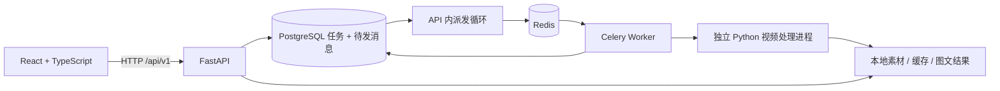

# 前后端分离架构

实现日期：2026-09-15。当前是本机单人视频学习工作区，复用原 Python 视频处理核心。

## 服务边界

前端独立构建和部署，后端只提供 API、文件与 OpenAPI 文档。开发时 Vite 代理 `/api`；容器部署由 Nginx 代理。浏览器不接触模型密钥、数据库凭据或服务器文件路径。

| 目录 | 职责 |
| --- | --- |
| `frontend/src/pages` | 笔记库、处理进度、对照阅读、能力设置 |
| `frontend/src/components` | 导入表单、笔记卡片 |
| `frontend/src/api` | OpenAPI 生成的类型、统一请求入口、显示格式 |
| `src/knowdelta/web/app.py` | HTTP 校验、响应与文件访问 |
| `src/knowdelta/web/services.py` | 任务创建、重试、产物访问规则 |
| `src/knowdelta/web/tables.py` | 任务与待发消息表 |
| `src/knowdelta/web/worker.py` | 派发、领取、心跳、取消与中断恢复 |
| `src/knowdelta/web/runner.py` | 隔离执行原视频处理核心 |
| `src/knowdelta/pipeline.py` | 获取、转写、抽帧、生成与导出 |
| `backend/migrations` | Alembic 数据库迁移 |

## 一次生成如何完成

1. 前端提交 B 站地址或本地视频和可选字幕；生成方式为原文整理、文字模型或视觉模型。
2. API 在同一数据库事务中写任务和待发消息，立即返回 `202 + job_id`。模型未配置时拒绝依赖该模型的模式。
3. 派发循环把消息送到 Redis；成功后才记录已发送。队列暂不可用时，数据库仍保留待发任务。
4. Worker 用条件更新领取 `queued + attempt` 的任务，防止重复消息重复执行。默认单并发，避免音视频与本地 ASR 争抢内存。
5. Worker 启动独立进程运行已有管线：字幕优先、必要时 ASR、筛选截图、组织章节、校验引用、导出。
6. 每个成功阶段复用原有缓存。Worker 每秒同步阶段与心跳，前端每 1.5 秒刷新正在处理的任务。
7. 完成后写入笔记元数据，阅读页按任务 ID 获取结构化正文、截图、转写与视频。文件不通过任意路径参数暴露。

原文整理保留字幕/转写原句，不调用摘要模型；模型模式才按主题提炼。视觉模式将候选截图发给配置的视觉模型。配图与正文都保留时间来源。

## 任务一致性与恢复

- 状态：`queued → running → completed / failed / cancelled`；失败或取消后重试递增 `attempt`。
- 创建请求使用 `Idempotency-Key`，网络重试复用相同键，表单内容变化需换新键。
- 数据库是状态权威来源，Redis 负责投递。使用事务待发消息（outbox）避免“任务已写入但发布消息失败”导致丢任务。
- 发布成功但确认未落库时可能再次投递；Worker 条件领取使重复消息无害。这里不宣称消息只会投递一次。
- 取消更新数据库，Worker 检测后终止整个处理进程组；旧 attempt 无法覆盖重试后的状态。
- 超过两分钟没有心跳的运行任务标为失败，允许用户重试；不会无限自动重跑可能产生费用的模型调用。
- 单任务有总超时；处理同一素材仍由原管线的文件锁保护。强制杀死整个 Worker 后，子进程可能短暂残留，文件锁释放后方可重试。
- 进度条代表阶段位置，不代表剩余时间的精确预测。

## API 契约与前端状态

FastAPI/Pydantic 导出 `backend/openapi.json`，`openapi-typescript` 生成前端类型，`openapi-fetch` 提供类型约束请求。修改 schema 后重新生成并提交两份文件，运行 TypeScript 构建检查调用方。

TanStack Query 管理服务端查询、缓存、错误和失效刷新；表单、视图切换等临时状态留在 React 组件。依赖版本由 `uv.lock` 与 `frontend/pnpm-lock.yaml` 固定。数据库结构由迁移维护，应用启动不偷偷建表。

## 视觉与交互

米白背景、森林绿主色、衬线标题与清晰正文构成安静的学习空间。首页聚焦导入与已有笔记；阅读页将视频/目录与正文分栏，手机改为单栏。没有伪造统计、示例笔记或假进度。

Radix Dialog 提供导入与图片放大的焦点管理；支持键盘焦点、跳转主内容、减少动态效果偏好。页面明确区分原文整理和模型生成，用户可以随时对照转写与视频。

## 参考项目与取舍

- [FastAPI Full Stack Template](https://github.com/fastapi/full-stack-fastapi-template)：借鉴 React/Vite/TypeScript、API 类型生成、数据库迁移和容器化的组织方式。当前上游部署方式与本项目不同，本项目按需求保持独立前端服务。
- [FastAPI Background Tasks 文档](https://fastapi.tiangolo.com/tutorial/background-tasks/)：重型视频处理使用独立 Celery Worker，HTTP 请求只接受任务。
- [Celery Tasks 文档](https://docs.celeryq.dev/en/stable/userguide/tasks.html)：结合幂等处理、延迟确认和工作进程故障设计重试语义。
- [TanStack Query 文档](https://tanstack.com/query/latest/docs/framework/react/overview)：用服务端状态缓存管理接口数据。
- [BiliNote](https://github.com/JefferyHcool/BiliNote)：参考视频转笔记、截图和来源时间的产品交互；继续使用本仓库已有生成管线。

未引入向量数据库、额外 Agent 编排或账号系统：当前范围不需要这些服务。`DEVELOPMENT.md` 中的个性化学习与检索规划仍是后续工作。

## 部署与边界

开发版使用本机 API/Worker/前端加容器化 PostgreSQL/Redis。完整容器版使用独立项目和卷，API 与 Worker 共享媒体卷，Nginx 提供前端。数据库与媒体需要一起备份；目前数据库记录绝对素材路径，跨宿主或容器迁移需要同步路径并重新导入，不能直接混用开发数据卷。

这版没有身份认证，只用于本机单人工作区，监听回环端口。Origin 与 Host 校验降低本地网页误调用风险，但不构成多人权限系统。公网使用前必须补齐认证授权、HTTPS、请求限流、上传存储配额和运维监控。

笔记库当前读取最新 100 条，搜索和筛选在这些结果内进行；后续增长应改成服务端分页搜索。上传过程中尚无取消/断点续传。CLI Cookie 参数仍可用，网页未开放 Cookie 上传。真实模型的内容质量需配置服务后单独验收。
